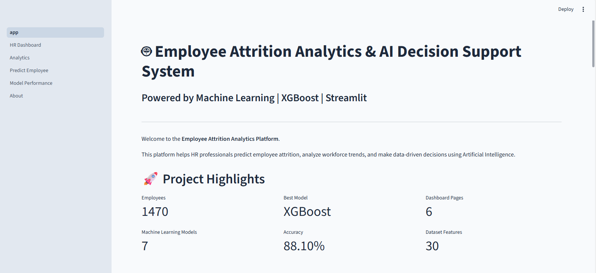
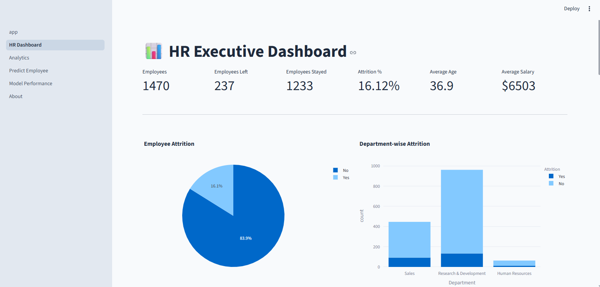
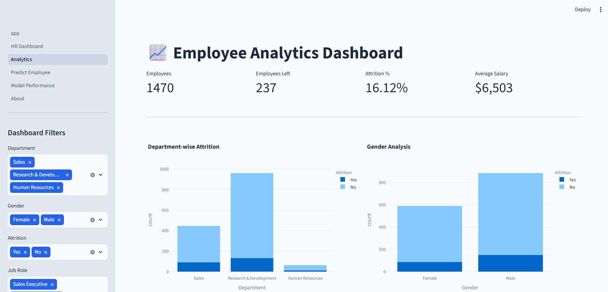
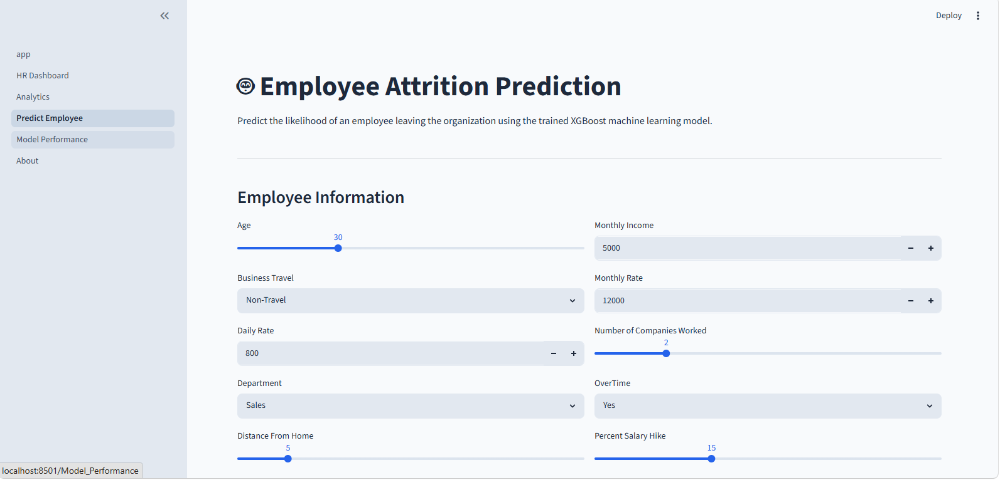
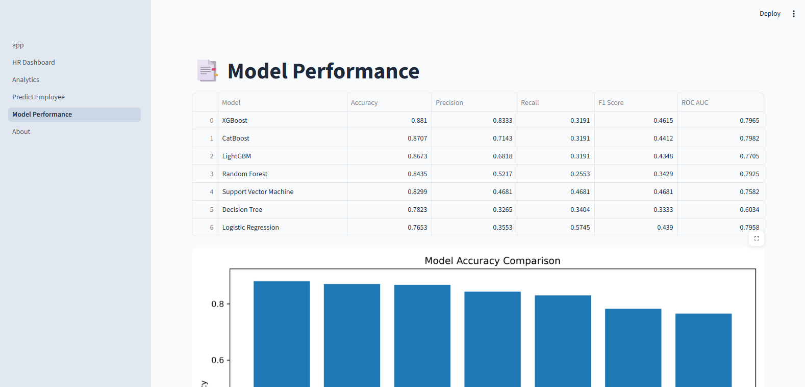
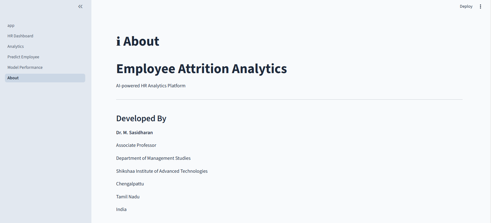

<p align="center">
  
</p>

# 🤖 Employee Attrition Analytics & AI Decision Support System

<p align="center">


</p>

---

## 📖 Project Overview

Employee Attrition Analytics is an AI-powered Human Resource Analytics platform that predicts employee attrition using Machine Learning and provides intelligent insights to help HR professionals improve employee retention.

The application combines data analytics, predictive modeling, and interactive dashboards to support data-driven HR decision-making.

---

## 🎯 Objectives

- Predict whether an employee is likely to leave the organization.
- Analyze HR data through interactive dashboards.
- Compare multiple Machine Learning algorithms.
- Recommend HR actions based on prediction results.
- Help organizations reduce employee turnover.

---

# ✨ Features

- 📊 Executive HR Dashboard
- 📈 Interactive Analytics Dashboard
- 🤖 Employee Attrition Prediction
- 🧠 AI-based Recommendation Engine
- 📉 Exploratory Data Analysis (EDA)
- 📑 Model Performance Comparison
- 📊 Confusion Matrix
- 📈 ROC Curve
- 💾 Automatic Best Model Selection
- 🌐 Streamlit Web Application
- 📁 Downloadable Prediction Results
- ⚡ Fast and User-Friendly Interface

---

# 💻 Technologies Used

| Category | Technology |
|------------|----------------|
| Programming Language | Python |
| Data Analysis | Pandas, NumPy |
| Visualization | Matplotlib, Plotly |
| Machine Learning | Scikit-Learn |
| ML Algorithms | Logistic Regression, Decision Tree, Random Forest, SVM, XGBoost, LightGBM, CatBoost |
| Web Framework | Streamlit |
| Model Serialization | Joblib |
| Version Control | Git & GitHub |

---

# 🤖 Machine Learning Models

The following Machine Learning algorithms were implemented and evaluated:

- Logistic Regression
- Decision Tree
- Random Forest
- Support Vector Machine (SVM)
- XGBoost
- LightGBM
- CatBoost

The application automatically selects and saves the best-performing model based on evaluation metrics.

---

# 📊 Model Performance

The following evaluation metrics are used to compare the models:

- Accuracy
- Precision
- Recall
- F1 Score
- ROC-AUC Score

The best-performing model is automatically saved as:

```text
models/best_model.pkl
```

---

# 📂 Project Structure

```text
Employee-Attrition-Prediction
│
├── assets/
│   └── banner.png
│
├── dataset/
│   └── WA_Fn-UseC_-HR-Employee-Attrition.csv
│
├── models/
│   └── best_model.pkl
│
├── pages/
│   ├── 1_HR_Dashboard.py
│   ├── 2_Analytics.py
│   ├── 3_Predict_Employee.py
│   ├── 4_Model_Performance.py
│   └── 5_About.py
│
├── results/
│
├── screenshots/
│
├── src/
│
├── app.py
├── train_model.py
├── generate_charts.py
├── requirements.txt
├── README.md
└── LICENSE

---

# ⚙️ Installation

Clone the repository

```bash
git clone https://github.com/itzmemsd/Employee-Attrition-Prediction.git
```

Move into the project directory

```bash
cd Employee-Attrition-Prediction
```

Create a virtual environment

```bash
python -m venv venv
```

Activate the virtual environment

### Windows

```bash
venv\Scripts\activate
```

### Linux / macOS

```bash
source venv/bin/activate
```

Install dependencies

```bash
pip install -r requirements.txt
```

---

# ▶️ Running the Application

Launch the Streamlit application

```bash
streamlit run app.py
```

The application will open in your browser at

```text
http://localhost:8501
```
---

# 📸 Application Screenshots

> **Note:** Replace these placeholder images with screenshots from your application after deployment.

## 🏠 Home Page

<p align="center">

</p>

---

## 📊 Executive Dashboard

<p align="center">

</p>

---

## 📈 Analytics Dashboard

<p align="center">

</p>

---

## 🤖 Employee Prediction

<p align="center">

</p>

---

## 📑 Model Performance

<p align="center">

</p>

---

## ℹ About

<p align="center">

</p>

---

# 📊 Exploratory Data Analysis

The project performs extensive Exploratory Data Analysis (EDA) before model training.

### Visualizations Generated

- Employee Attrition Distribution
- Gender Distribution
- Department Distribution
- Job Role Distribution
- Salary Distribution
- Age Distribution
- Correlation Analysis

Generated figures are stored inside:

```text
results/
```

---

# 📈 Machine Learning Workflow

```text
                 Dataset
                    │
                    ▼
           Data Preprocessing
                    │
                    ▼
          Exploratory Data Analysis
                    │
                    ▼
         Feature Engineering
                    │
                    ▼
          Train-Test Split
                    │
                    ▼
         Machine Learning Models
                    │
                    ▼
       Model Performance Evaluation
                    │
                    ▼
        Best Model Selection
                    │
                    ▼
      Employee Attrition Prediction
                    │
                    ▼
      AI Recommendation Engine
```

---

# 🧠 Artificial Intelligence Features

The application provides intelligent recommendations after every prediction.

Example recommendations include:

- Improve employee engagement.
- Review salary structure.
- Reduce overtime.
- Improve work-life balance.
- Conduct career development programs.
- Increase employee recognition.
- Improve leadership communication.

---

# 📊 Performance Evaluation Metrics

The models are evaluated using the following metrics:

| Metric | Purpose |
|---------|----------|
| Accuracy | Overall correctness |
| Precision | Positive prediction quality |
| Recall | Ability to identify attrition |
| F1 Score | Balance between Precision & Recall |
| ROC-AUC | Overall classifier performance |

---

# 📁 Output Files

After training, the following files are automatically generated:

```text
models/
    best_model.pkl

results/
    model_comparison.csv
    classification_report.txt
    confusion_matrix.png
    roc_curve.png
    accuracy_comparison.png
```

---

# 📈 Best Model

🏆 **XGBoost**

Approximate Performance:

| Metric | Score |
|---------|--------|
| Accuracy | 88.10% |
| Precision | 83.33% |
| Recall | 31.91% |
| F1 Score | 46.15% |
| ROC-AUC | 79.65% |

> Performance may vary slightly depending on preprocessing and train-test split.

---

# 📦 Python Packages Used

- pandas
- numpy
- matplotlib
- plotly
- streamlit
- scikit-learn
- imbalanced-learn
- xgboost
- lightgbm
- catboost
- shap
- joblib
- openpyxl

---
# 🌟 Key Highlights

✅ End-to-End Machine Learning Project

✅ HR Analytics Dashboard

✅ Employee Attrition Prediction

✅ Interactive Streamlit Web Application

✅ Multiple Machine Learning Models

✅ Automatic Best Model Selection

✅ Professional GitHub Repository

✅ AI-Based Recommendation Engine

✅ Research-Oriented Project

---

# 🚀 Future Enhancements

The following features are planned for future versions:

- 🔹 Deep Learning Models (ANN)
- 🔹 Explainable AI (Advanced SHAP Integration)
- 🔹 Employee Performance Prediction
- 🔹 Salary Prediction Module
- 🔹 Resume Screening using AI
- 🔹 Attendance Analytics
- 🔹 Real-Time HR Dashboard
- 🔹 REST API Development
- 🔹 Docker Containerization
- 🔹 Cloud Deployment (AWS / Azure / GCP)
- 🔹 Mobile Application
- 🔹 Role-Based User Authentication

---

# 🌍 Deployment

This project can be deployed using:

- Streamlit Community Cloud
- Render
- Hugging Face Spaces
- Docker
- Microsoft Azure
- AWS EC2

Deployment instructions will be added in future releases.

---

# 🤝 Contributing

Contributions are welcome.

If you would like to contribute:

1. Fork this repository
2. Create your feature branch

```bash
git checkout -b feature-name
```

3. Commit your changes

```bash
git commit -m "Added new feature"
```

4. Push your branch

```bash
git push origin feature-name
```

5. Open a Pull Request

Please read the **CONTRIBUTING.md** file before submitting contributions.

---

# 🛡️ Security

Security issues should **not** be reported through public GitHub issues.

Please follow the instructions in:

```
SECURITY.md
```

---

# 📜 License

This project is licensed under the **MIT License**.

For more information refer to:

```
LICENSE
```

---

# 📂 Repository Files

```
README.md
LICENSE
CONTRIBUTING.md
CHANGELOG.md
CODE_OF_CONDUCT.md
SECURITY.md
requirements.txt
```

---

# 📊 Research Applications

This project can be extended for research in:

- Human Resource Analytics
- Employee Retention
- Artificial Intelligence
- Machine Learning
- Predictive Analytics
- Explainable AI
- Workforce Analytics
- Organizational Behaviour
- HR Decision Support Systems

---

# 🎓 Educational Value

This project is suitable for:

- Final Year Engineering Projects
- MBA (AI & DS)
- MCA Projects
- Data Science Portfolio
- Machine Learning Portfolio
- Research Publications
- Hackathons
- AI Competitions

---

# 🔄 Version History

| Version | Description |
|----------|-------------|
| v1.0 | Initial Release |
| v1.1 | Interactive Dashboard |
| v1.2 | AI Recommendation Engine |
| v1.3 | Professional UI |
| v2.0 | Planned Future Release |

---

# 📈 Repository Statistics

Project Includes

- 30+ Features
- 7 Machine Learning Models
- Interactive Dashboard
- AI Recommendation Engine
- Model Comparison
- Data Visualization
- Professional Documentation
- Streamlit Web Application
- GitHub Ready Project

---

# 📌 Citation

If you use this project in your research, please cite it appropriately.

Citation details will be added in future releases.

---
# 👨‍💻 Author

## Dr. M. Sasidharan

**Associate Professor**  
Department of Management Studies  
Shikshaa Institute of Advanced Technologies (SIAT)

### Academic Qualifications

- 🎓 Ph.D. in Business Administration
- 🎓 MBA in Aviation Management
- 🎓 B.E. in Aeronautical Engineering
- 🎓 PG Diploma in Aviation Management
- 🎓 PG Diploma in Digital Marketing

### Research Interests

- Artificial Intelligence
- Machine Learning
- Human Resource Analytics
- Predictive Analytics
- Explainable AI
- Data Science
- Aviation Management

---

# 📬 Connect With Me

### GitHub

https://github.com/itzmemsd

### LinkedIn

*https://www.linkedin.com/in/itzmemsd*

### Email

*sasiaviation@yahoo.in*

---

# 🙏 Acknowledgements

This project was developed as an end-to-end Machine Learning application to demonstrate the practical use of Artificial Intelligence in Human Resource Analytics.

Special thanks to:

- IBM for providing the HR Analytics sample dataset.
- The open-source Python community.
- Streamlit developers.
- Scikit-Learn contributors.
- XGBoost, LightGBM, and CatBoost development teams.

---

# ⭐ If You Like This Project

If you found this repository useful:

⭐ Star this repository

🍴 Fork this repository

🛠️ Contribute to improve it

📢 Share it with others

Your support motivates future development.

---

# 🗂️ Repository Information

| Item | Details |
|------|---------|
| Project | Employee Attrition Analytics & AI Decision Support System |
| Language | Python |
| Framework | Streamlit |
| Machine Learning | Scikit-Learn |
| Best Model | XGBoost |
| Dataset | IBM HR Analytics Employee Attrition Dataset |
| License | MIT |

---

# 📅 Project Timeline

| Phase | Status |
|--------|--------|
| Data Collection | ✅ Completed |
| Data Preprocessing | ✅ Completed |
| Exploratory Data Analysis | ✅ Completed |
| Feature Engineering | ✅ Completed |
| Machine Learning | ✅ Completed |
| Model Evaluation | ✅ Completed |
| Dashboard Development | ✅ Completed |
| Streamlit Deployment | 🔄 Planned |
| Documentation | ✅ Completed |

---

# 🛠️ Skills Demonstrated

This project demonstrates practical experience in:

- Python Programming
- Data Cleaning
- Feature Engineering
- Exploratory Data Analysis
- Machine Learning
- Model Evaluation
- Data Visualization
- Dashboard Development
- Streamlit Application Development
- Git & GitHub
- Software Documentation

---

# 📚 References

1. IBM HR Analytics Employee Attrition Dataset
2. Scikit-Learn Documentation
3. XGBoost Documentation
4. LightGBM Documentation
5. CatBoost Documentation
6. Streamlit Documentation
7. Plotly Documentation
8. Pandas Documentation

---

# 🚀 What's Next?

Future versions of this project may include:

- Deep Learning-based prediction models
- Explainable AI with advanced SHAP integration
- Employee performance prediction
- REST API services
- Cloud deployment
- User authentication
- Role-based dashboards
- HR chatbot integration

---

# 📄 Disclaimer

This project is intended for educational, research, and demonstration purposes.

Predictions generated by this application should support decision-making and should not be used as the sole basis for employment-related decisions.

---

<p align="center">

## ⭐ Thank You for Visiting ⭐

If you found this project helpful, please consider giving it a **Star** on GitHub.

Made with ❤️ using **Python**, **Streamlit**, and **Machine Learning**.

</p>