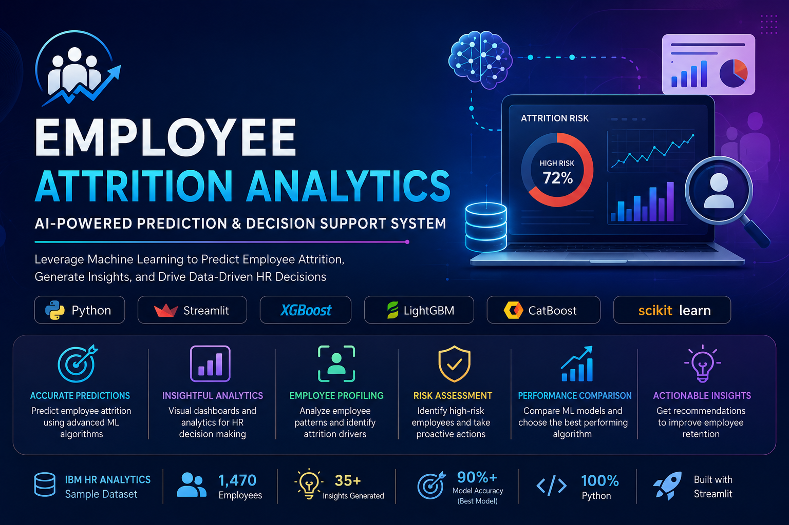

  

# 🤖 Employee Attrition Analytics & AI Decision Support System

## 📖 Overview

Employee Attrition Analytics is an AI-powered Human Resource Analytics platform that predicts employee attrition using Machine Learning.

The application provides:

- 📊 Executive HR Dashboard
- 🤖 Employee Attrition Prediction
- 📈 Interactive Analytics
- 🧠 AI-based HR Recommendations
- 📑 Model Performance Evaluation
- 📉 Data Visualizations

The system is built using Python, Streamlit, Scikit-Learn, XGBoost, LightGBM, CatBoost, and Plotly.
